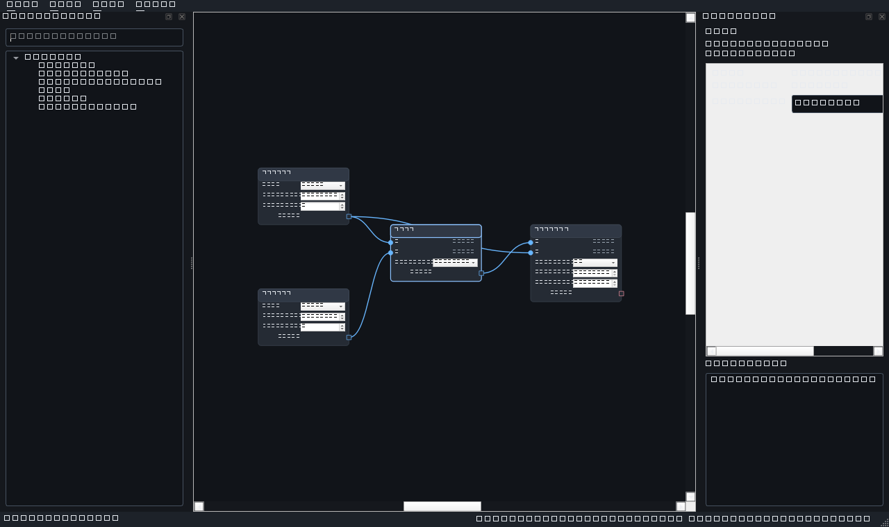

# Phase 2 completion report

## Status

Phase 2 — Minimal node editor and document commands is complete on Windows 11 x64
using the project-local, uv-managed CPython 3.12 environment and PySide6 6.10.

The implementation checkpoints are:

- `b76b70b` — `feat: add graph document commands and clipboard`
- `4d50435` — `feat: add minimal graph editor and document lifecycle`

Together these checkpoints provide a functional utility-node editor over the Phase 1
`GraphDocument`. A user can create, connect, edit, move, duplicate, copy, paste, delete,
save, reopen, recover, undo, and redo a graph without introducing a second mutable graph
representation.

## Implemented

### Editor shell and visual language

- Replaced the Phase 0 placeholder window with the required `QMainWindow` shell: File,
  Edit, View, and Graph menus; searchable node library dock; central graphics canvas;
  inspector dock; and status bar.
- Added a centralized action registry with stable object names, shortcuts, status tips,
  and enabled-state updates for document and selection context.
- Added centralized immutable theme colour and metric tokens. Widget and graphics fonts
  use point sizes, and typed ports combine colour with square, circle, or diamond shapes.
- Added immutable scene projections for nodes, ports, parameters, connections, and the
  complete graph. Validation diagnostics from Phase 1 are projected into node state and
  the inspector.
- Added custom node, port, cable, and temporary-cable graphics items. Cable selection uses
  an explicit stroked hit shape rather than relying on the thin visible path.
- Added wheel zoom, middle-button or Space-drag panning, marquee selection, frame-all,
  frame-selection, keyboard deletion, and graph search shortcuts.

### Node and connection workflows

- Added grouped, searchable utility-node creation through the left library, palette
  drag/drop, graph search, context search, and Space-tap search.
- Search indexes display name, category, description, stable type ID, and immutable node
  aliases. Utility aliases include terms such as `constant`, `calculator`, and `switch`.
- Added single- and multi-node selection and movement. Graphics positions remain view-only
  during a gesture and commit to `GraphDocument` as one move command.
- Added direction-independent cable gestures, compiler-backed compatible-target
  highlighting, typed connection creation, and occupied-input replacement as one undoable
  command.
- Dropping a cable on empty canvas opens search restricted to node definitions with a
  compiler-accepted compatible port, then inserts and connects the chosen node as one undo
  macro.
- Added direct cable selection and deletion. Mixed node/cable deletion excludes duplicate
  incident edges and commits as one exact undo macro.
- Added duplicate and copy/paste workflows with fresh UUIDs, internal-edge preservation,
  deterministic offsets, and a custom Qt clipboard MIME adapter over the separately
  versioned Qt-free clipboard fragment format.

### Parameters and inspector

- Added scalar editors for FLOAT, INT, BOOL, STRING, STRING choice, and COLOR parameters.
- Added connectable parameter rows that show a diamond socket and literal editor together.
  An incoming connection disables, but does not erase, the literal fallback; disconnect or
  undo restores the editor with the preserved value.
- Added inspector metadata, parameter editing, and graph validation diagnostics.

### Document lifecycle

- Added one `DocumentSession` that owns the sole mutable `GraphDocument`, registry,
  `GraphCompiler`, document-owned `QUndoStack`, path, validation report, and immutable view
  projection.
- Added clean/dirty tracking through the undo stack clean index and window-title/action
  updates.
- Added New, Open, Save, Save As, recent-file settings, dirty-document Save/Discard/Cancel
  decisions, malformed-file reporting, and deliberate close behavior.
- Reused the existing schema-v1 `save_graph()` and `load_graph()` implementation; the UI
  does not duplicate graph JSON serialization.
- Added a Qt-free recovery store and a 60-second inactivity autosave timer. Startup can
  offer newer recovery records, recovered documents remain dirty, and explicit save or a
  deliberate discard removes the corresponding recovery file.
- Added deterministic Qt object ownership in tests and a weak command refresh callback so
  C++-owned undo commands do not retain the `DocumentSession` that owns their stack.

## Interfaces added or changed

### Graph and node metadata

- `GraphDocument` gained narrow restore/query facades used by reversible commands,
  including explicit node/connection restoration, incoming-edge lookup, and incident-edge
  lookup. The mutable representation remains unchanged and Qt-free.
- `GraphCompiler.connection_compatibility()` exposes prospective Phase 1 validation for
  editor gestures without duplicating type, generic, widening, cardinality, or cycle logic.
- `NodeDefinition.aliases` adds immutable, validated search metadata without changing
  existing positional construction or runtime semantics.

### Qt-free persistence

- `synesthesia_machine.persistence.clipboard`
  - `CLIPBOARD_FRAGMENT_VERSION`, `ClipboardFragment`
  - `copy_fragment`, `fragment_to_json`, `fragment_from_json`, `remap_fragment`
- `synesthesia_machine.persistence.autosave`
  - `RecoveryRecord`, `AutosaveStore`

Clipboard fragments have their own version independent of graph schema version 1. Recovery
files continue to use the authoritative graph serializer.

### UI adapters

- `synesthesia_machine.ui.commands`
  - `AddNodeCommand`, `DeleteNodesCommand`, `MoveNodesCommand`, `SetParameterCommand`
  - `AddConnectionCommand`, `ReplaceConnectionCommand`, `RemoveConnectionCommand`
  - `PasteCommand`, `DuplicateCommand`, `IncompatibleConnectionError`
- `synesthesia_machine.ui.session.DocumentSession`
  - document lifecycle, command dispatch, compatibility queries, compatible-node lookup,
    and immutable graph projection
- `synesthesia_machine.ui.view_models`
  - immutable node, port, parameter, connection, and graph view models
- `synesthesia_machine.ui.graphics`
  - custom node, port, connection, and temporary-connection graphics items
- `synesthesia_machine.ui.canvas`
  - `GraphScene` and `GraphView`
- `synesthesia_machine.ui.parameter_editors.create_parameter_editor`
- `synesthesia_machine.ui.widgets`
  - node library/tree, graph search dialog, and inspector panel
- `synesthesia_machine.ui.main_window.MainWindow`
- `synesthesia_machine.app.application.MainWindow` remains the application-facing facade.

## Architecture boundary evidence

- `GraphDocument` is the only mutable graph-domain representation. `GraphScene` stores only
  UUID-to-graphics references and immutable view models, then rebuilds from session events.
- Every editor graph mutation is represented by a `QUndoCommand` and pushed to the single
  `QUndoStack` owned by `DocumentSession`. Multi-step deletion and insert-and-connect use
  undo macros; occupied-input replacement is one command.
- Graphics movement does not mutate the document until one move command commits the final
  positions.
- Connection acceptance and compatible-node discovery delegate to
  `GraphCompiler.connection_compatibility()`. UI code does not reproduce Phase 1 type
  compatibility, generic unification, `INT -> FLOAT` widening, or cycle checks.
- Graph JSON remains owned by `synesthesia_machine.persistence.graph_io`; Qt clipboard code
  adapts a versioned Qt-free fragment serializer instead of defining another graph format.
- `contracts/`, `graph/`, `nodes/`, `runtime/`, and core persistence remain importable and
  testable without creating a Qt application. PySide6 imports are confined to `ui/` and
  application composition.
- Theme RGB literals are centralized in `ui/theme.py`; graphics and widgets consume tokens
  rather than defining independent colours.

## Tests and results

Pre-report implementation acceptance was run on Windows 11 x64 with CPython 3.12.13:

| Command | Result |
| --- | --- |
| `uv run check` | Passed; 75 files already formatted, Ruff clean, Pyright strict with 0 errors/warnings/information messages. |
| `uv run test` | Passed and exited normally; 133 tests in 3.82 seconds. |
| `uv run pytest tests/phase1 -q` | Passed; 93 Phase 1 tests. |
| `uv run pytest tests/phase2 -q` | Passed; 30 Phase 2 tests. |
| `git diff --check` | Passed; no whitespace errors. |
| `$env:QT_QPA_PLATFORM='offscreen'; uv run synmachine --smoke-test` | Passed; the real editor shell started and stopped. |

The complete suite contains 93 Phase 1 tests, 30 Phase 2 tests, and 10 Phase 0/smoke
tests. Phase 2 coverage includes:

- redo/undo for all graph mutations, parameter-command merging, move-command merging,
  exact state restoration, and repeated undo/redo without duplicate domain objects;
- compiler-backed incompatible-edge refusal, direction-normalized cable gestures,
  compatible highlighting, replacement of an occupied input as one command, and practical
  cable hit testing;
- mixed node/cable deletion and insert-and-connect as one exact undo macro each;
- versioned clipboard round trips, UUID remapping, deterministic paste offsets, internal
  edge preservation, and fresh identities for duplicate/paste;
- fixed shell structure, menus, docks, action metadata, shortcuts, accessibility names,
  palette search, graph search, and alias indexing;
- view-only multi-node movement before one domain commit;
- FLOAT, INT, BOOL, STRING, choice, and COLOR editors plus connected-parameter fallback
  preservation;
- save/open positions and parameters, clean/dirty transitions, one replacement prompt,
  malformed-file reporting, recovery restore, recovered dirty state, and recovery cleanup
  after explicit save;
- offscreen scaling subprocesses at `QT_SCALE_FACTOR` 1.0, 1.25, 1.5, and 2.0, with both
  the main window and graph view reporting the requested device-pixel ratio;
- Qt fixture cleanup, clipboard ownership release, and normal process exit after undo and
  copy/paste tests.

All Phase 1 regression tests remain green.

## Screenshot and manual checks

`docs/phase-2-editor.png` was generated from the real `MainWindow` at 1280 x 760 on the
offscreen Qt backend and then inspected at full size. The captured graph contains Number,
Math, and Compare nodes plus four typed connections.

Manual review confirmed:

- the menu bar, searchable grouped palette, graph canvas, inspector, validation list, and
  status bar are present and unclipped;
- the dark theme is coherent and text, parameter rows, metadata, and diagnostics are
  readable;
- square output, circle input, and typed cable cues are visible without depending on colour
  alone;
- selected-node emphasis and cable routing are clear;
- the expected validation messages for the intentionally incomplete Compare node are
  visible.

## Known limitations

- Phase 2 intentionally supports the utility registry only. Real video, camera, audio,
  image-processing, MIDI source/sink, and engine-process integration remain out of scope.
- Groups, minimap, elaborate animation, advanced graph layout, and final visual polish are
  deferred.
- Autosave uses inactivity-based snapshots and startup recovery offers; it is not a
  continuous journal and does not merge concurrent external edits.
- Clipboard transfer is local Qt clipboard MIME data; cross-version behavior is limited to
  the explicit fragment-version validation currently implemented.
- The offscreen Windows environment logs a nonfatal PySide6 warning that its wheel does not
  contain a `lib/fonts` directory. Rendering, scaling tests, and smoke startup still pass;
  no package was added solely to suppress this environment warning.

## Architecture deviations

No architecture deviation or new dependency was introduced, and no ADR was required.

The narrow `NodeDefinition.aliases` addition is core metadata required by architecture
section 13.6 search behavior; it is immutable, validated, backward-compatible, and Qt-free.
The graph restore/query and prospective-compatibility additions are narrow facades that
allow commands and editor gestures to reuse the existing domain/compiler ownership rather
than duplicating it.

## Recommended next work

Phase 3 may begin only as a separate work item after this report and its final locked gates
are committed. Future work should preserve the Phase 1 and Phase 2 boundaries:

1. Keep `GraphDocument`, graph schema version 1, command ownership, and stable node/port/
   parameter IDs compatible unless an explicit migration is added.
2. Connect document activation to the process-separated engine/client architecture without
   moving runtime ownership into the editor scene.
3. Add the first production source and visualization nodes behind immutable contracts and
   compiler-owned clock/type validation.
4. Preserve event-driven UI projection and command-only mutations as runtime status and
   diagnostics are introduced.
5. Continue locked quality gates, offscreen Qt coverage, scaling checks, visual evidence,
   and meaningful Git checkpoints for later phases.