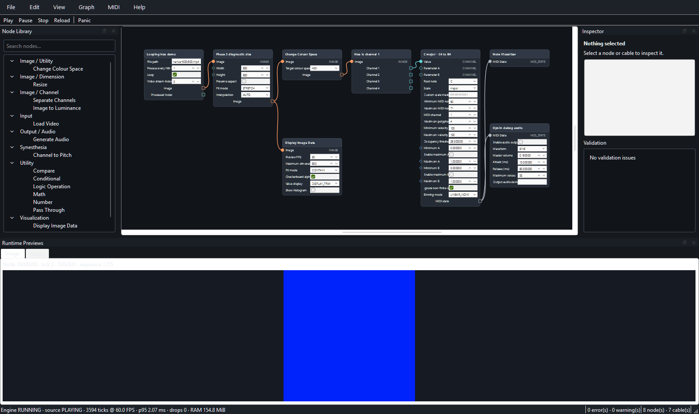

# Phase 3 completion report

## Status

Phase 3 — First end-to-end video-to-note vertical slice is complete on Windows 11 x64 using the
project-local, uv-managed CPython 3.12 environment and PySide6 6.10.

The delivered saved instrument is
[`examples/phase3/hue_chord.synmachine.json`](../examples/phase3/hue_chord.synmachine.json):

```text
Load Video → Resize (500×500) → Change Colour Space (HSV)
           → Separate Channels (Hue) → Channel to Pitch
Resize → Display Image Data
Channel to Pitch → Note Visualizer
Channel to Pitch → Generate Audio (disabled by default)
```

It loads a real generated MPEG-4 video through a graph-relative path, follows PyAV presentation
timestamps, publishes immutable image/channel/MIDI values, displays image and note previews, and
can drive the opt-in callback-safe debug synthesizer. The editor controls the runtime exclusively
through the final-shaped `EngineClient` API.

The Phase 3 implementation and evidence checkpoints are:

- `26e012b` — `feat: add phase 3 engine and image foundations`
- `113e0fa` — `feat: add deterministic video playback runtime`
- `5b371c0` — `feat: add channel histogram MIDI mapping`
- `b8e4791` — `feat: add runtime previews and transport UI`
- `3372ba6` — `feat: add callback-safe debug audio`
- `75f595b` — `feat: add phase 3 hue chord example`
- `7af137b` — `chore: capture phase 3 performance evidence`

## Implemented

### Runtime contracts and client boundary

- Added immutable runtime image, channel-view, frame-context, desired MIDI-state, preview, source
  status, and engine-metric values. NumPy payloads are copied or exposed read-only at contract
  boundaries.
- Added the final-shaped `EngineClient` protocol for activation; play, pause, resume, stop, reload,
  and seek; panic; source status; metrics; sequence-based image/note preview polling; idle waits;
  and deterministic close.
- Added `InProcessEngineClient` as the Phase 3 implementation. Application composition injects it
  into `MainWindow`; UI code does not own a scheduler, decoder, synth, or runtime node directly.
- Added immutable graph activation with compiler validation, per-source runtime ownership,
  automatic sink/visualizer demand roots, latest-frame graph dispatch, metrics, panic, and cleanup.

### Video, colour, and image processing

- Added colour-space descriptors and finite-value-safe conversion among normalized sRGB/RGBA,
  linear RGB, HSV, HSL, CIE Lab, and YCrCb representations, including display conversion and channel
  metadata.
- Added immutable normalized float32 image frames, read-only channel views, deterministic resize,
  Change Colour Space, and Separate Channels nodes. One decoded frame can fan out without mutation.
- Added a PyAV video source with open/play/pause/stop/reload/seek lifecycle, bounded decode-ahead,
  presentation-timestamp pacing for CFR and VFR media, loop/reset behavior, and explicit status.
- Implemented `process_every_nth_frame` selection so `N=1` processes every source frame and higher
  values retain source playback timing while selecting source frames 1, 1+N, 1+2N, and so on.
  Processed tick indices begin at one and count only frames emitted into the graph.
- Added latest-frame-wins scheduling: one frame may execute while one pending slot retains only the
  newest unprocessed frame. Drops and selection skips are separate visible metrics.

### Channel-to-note mapping

- Added validated scale definitions and selectors for chromatic, major, natural/harmonic/melodic
  minor, modal, pentatonic, whole-tone, diminished, and custom 12-step pitch sets.
- Added Channel to Pitch with valid-pixel masks, histogram occupancy relative to valid-pixel count,
  threshold-to-velocity remapping, root/scale/range filtering, deterministic ordering, and maximum
  polyphony.
- The example divides seven deterministic solid hue frames into seven histogram bins and maps them
  to C major over inclusive MIDI range 60–71. Its expected desired-note sequence is
  `(60, 62, 64, 65, 67, 69, 71)`, each at velocity 100.

### Previews, transport, and diagnostics

- Added a Qt-free latest-value `PreviewBroker`. Image previews are sanitized, resized, converted to
  immutable uint8, and throttled; note previews are compact, sorted, coalesced desired-state
  summaries. Graph activation invalidates previews from the prior generation.
- Added Display Image Data and Note Visualizer nodes, preview widgets/dock, 16 ms sequence polling,
  and independent image/note presentation in the Qt UI.
- Added Play, Pause/Resume, Stop, Reload, and Panic actions plus source/engine status. The status bar
  polls every 100 ms and reports state, processed ticks/FPS, p95 node time, drops, and RSS.
- Added `tools.phase3_performance`, which composes the real `MainWindow` around the real
  `InProcessEngineClient`, creates a 500×500/60 FPS fixture, runs the canonical graph, samples
  metrics, measures Qt event-loop heartbeat latency, captures a screenshot, and writes JSON
  evidence.

### Callback-safe debug audio

- Added Generate Audio as an automatic sink and explicit opt-in. It opens no PortAudio stream while
  disabled and is saved disabled in the example and performance graph.
- Added sine, square, saw, and triangle debug synthesis with desired-state snapshots, MIDI
  channel/note voice identity, velocity scaling, configurable attack/release, deterministic voice
  limiting, stereo finite-value/clipping guarantees, and A4 = 440 Hz tuning.
- The sounddevice callback reads an immutable desired-state snapshot and performs no graph work.
  Process/update and panic writers are serialized outside the callback.
- `NoData`, source reset/restart, global Panic, disable/reconfiguration, runtime close, and client
  close all clear or close synth state. Partial PortAudio start failures abort and close the stream,
  while unavailable output becomes a recoverable node error.

### Portable saved example

- Added the canonical eight-node, seven-connection Hue Chord graph and deterministic seven-frame
  media fixture under `examples/phase3`.
- File-boundary `load_graph()` resolves relative Load Video media paths against the graph directory;
  `save_graph()` prefers a relative media path when media is contained by the graph directory.
  Pure JSON conversion remains path-context-free.
- The checked-in graph round-trips through the production contextual serializer byte-for-byte,
  uses canonical Windows path form, and retains Generate Audio as `enabled=false`.

## Interfaces added or changed

### Client and runtime contracts

- `synesthesia_machine.contracts.engine_client`
  - `EngineClient`, `EngineActivation`, `EngineState`, `EngineMetrics`
  - `SourceStatus`, `SourceState`
  - `ImagePreview`, `NotePreview`, `NoteActivity`
- `synesthesia_machine.contracts.runtime_values`
  - immutable frame context, image/channel values, desired MIDI state, `NoData`, and array-freezing
    helpers
- `synesthesia_machine.runtime.InProcessEngineClient`
  - in-process implementation of the final client protocol; this implementation is replaceable by
    the Phase 4 process-backed client without changing the UI-facing API
- `synesthesia_machine.runtime.PreviewBroker`
  - latest-value, throttled, sequence-polled image and note publication

### Media, MIDI, and node definitions

- `synesthesia_machine.media`
  - colour descriptors/conversions, display conversion, resize, and `VideoSource`
- `synesthesia_machine.midi.scales`
  - immutable scale registry and pitch selection
- `synesthesia_machine.midi.debug_synth`
  - synth configuration/waveforms and callback-safe `DebugSynth`
- Application registry definitions for Load Video, Resize, Change Colour Space, Separate Channels,
  Channel to Pitch, Display Image Data, Note Visualizer, and Generate Audio

### UI and persistence

- `MainWindow` activates immutable graph snapshots through its injected `EngineClient`; transport,
  panic, source status, engine metrics, and preview polling all use that boundary.
- `PreviewPanel`, `ImagePreviewWidget`, and `NotePreviewWidget` are UI-only adapters over immutable
  client values.
- Context-aware file `save_graph()`/`load_graph()` behavior makes file-backed media portable while
  preserving schema version 1 and deterministic pure JSON conversion.

## Architecture boundary evidence

- The production UI knows only `EngineClient`. Tests inject a recording protocol implementation,
  while production injects `InProcessEngineClient`; no widget depends on that concrete class.
- Contracts, graph, persistence, node definitions, media logic, scheduler, preview broker, and
  engine facade remain Qt-free. The performance tool intentionally composes those production
  boundaries with the real Qt UI but does not move Qt into engine code.
- Runtime values are immutable, graph snapshots are compiled before activation, every demanded node
  runs at most once per tick, and fan-out reuses the same immutable result.
- PyAV owns decode and PTS timing. Decode-ahead and graph-pending storage are bounded, and
  latest-frame-wins backpressure prevents unbounded stale latency.
- Desired MIDI state, rather than repeated raw note messages, crosses node boundaries. Output and
  debug-audio lifecycles reconcile snapshots and expose global panic.
- Preview publication is non-blocking, latest-value, throttled, and sequence based; no Qt image or
  widget enters the runtime.
- Phase 3 uses the explicitly permitted in-process facade behind the final API. Process transport,
  shared-memory previews, camera capture, and real MIDI output remain isolated Phase 4 concerns.

## Tests and results

Final acceptance was run on Windows 11 x64 with CPython 3.12.13:

| Command | Result |
| --- | --- |
| `uv run check` | Passed; 109 Python files already formatted, Ruff clean, strict Pyright with 0 errors, warnings, or information messages. |
| `uv run test` | Passed; 192 tests in 3.80 seconds. |
| `uv run python -m pytest tests/phase3/test_in_process_engine.py::test_client_activates_real_video_and_drives_graph_through_final_api -q` (10 sequential repetitions) | Passed 10/10; validates the real source/client graph path without host-contention interference. |
| `uv run python -m tools.phase3_performance` | Passed; completed the real 60-second UI diagnostic and wrote JSON/PNG evidence. |
| `git diff --check` | Passed; no whitespace errors. |

The complete suite retains all Phase 1 and Phase 2 regressions and adds Phase 3 coverage for:

- generated CFR/VFR PTS pacing, Nth-frame selection, processed indices, pause/stop/reload/loop/seek,
  bounded decode behavior, source status, and recoverable media errors;
- colour conversion, metadata, finite-value display handling, immutable channel views, resize, and
  mutation-free frame fan-out;
- histogram occupancy/threshold/velocity cases, empty valid masks, scale/root/range/polyphony,
  deterministic desired state, and exact seven-frame C-major integration output;
- final-shaped client activation and transport, UI-only client injection, source/engine status,
  preview sequence coalescing, metrics, panic, close, and timer cleanup;
- preview immutability, sanitization, throttling, sizing, generation replacement, and image/note
  latest-value publication;
- debug-audio lazy open, configuration replacement, desired-state reconciliation, every waveform,
  callback buffers, attack/release, velocity, voice cap, panic silence/recovery, concurrent writer
  serialization, no-data/reset/close cleanup, and start-failure cleanup;
- portable saved-graph loading/saving, canonical deterministic serialization, disabled-by-default
  audio, real client playback, image/note previews, panic, and synth close.

Automated audio tests render through a mock stream that invokes the production callback. They prove
that the synth produces finite nonzero audio and releases/silences voices without opening a physical
device. A physical output was deliberately not opened during acceptance because the feature is
opt-in, machine-specific, and not required for hardware-independent completion evidence.

## Measured performance

Raw evidence is committed as [`phase-3-performance.json`](phase-3-performance.json). The run used
the real visible `MainWindow`, normal debounced graph activation, the real `InProcessEngineClient`,
and the canonical graph. It generated a 10-second, 600-frame MPEG-4 fixture at 500×500 and 60 FPS,
then looped that source for the requested 60-second measurement. The graph Resize node also remained
configured at 500×500. Generate Audio was asserted disabled, so the run opened no PortAudio device.

| Measurement | Result |
| --- | ---: |
| Requested / observed duration | 60.0 s / 60.0000546 s |
| Input | 500×500, 60 FPS, MPEG-4/yuv420p |
| Processed ticks | 3,600 |
| Processed FPS | 60.0179623 |
| p95 node invocation time | 2.071705 ms |
| Dropped before processing | 0 |
| Skipped by selection | 0 |
| Final process RSS | 155.71 MiB (163,274,752 bytes) |
| Peak sampled process RSS | 173.79 MiB (182,235,136 bytes) |
| Source warnings / last error | 0 / none |
| UI heartbeat callbacks | 1,199 of 1,200 (99.9167%) |
| UI heartbeat p50 / p95 / maximum | 50.0144 / 50.89382 / 56.6453 ms |
| Preview state at capture | image visible; note state visible |

The diagnostic criterion was a callback ratio of at least 90%, p95 heartbeat interval no greater
than 100 ms, and maximum interval no greater than 250 ms. The run passed all three limits and records
`responsive=true`. RSS samples remained bounded within the sampled range and returned close to the
early-run level rather than growing monotonically. This is Phase 3 diagnostic evidence, not a claim
that every future graph will sustain 60 FPS or a replacement for Phase 8 profiling/optimization.

## Screenshot and manual checks



`docs/phase-3-ui.png` was captured from the real 1600×950 `MainWindow` at the end of the 60-second
Windows run and inspected visually at full size. Manual review confirmed:

- all eight nodes and seven connections of the saved Hue Chord graph are visible and legible;
- the Load Video → Resize → HSV → Separate Hue → Channel to Pitch data path and all three terminal
  visualization/audio branches are connected as intended;
- the image preview contains the current generated hue frame and the note visualizer contains the
  current desired note;
- transport and Panic controls are present;
- the status line visibly reports `RUNNING`, source `PLAYING`, 3,600 ticks at 60.0 FPS, 2.07 ms p95,
  zero drops, and 155.7 MiB RAM;
- the UI is not obscured by an error dialog and the preview/status text is unclipped.

## Known limitations

- Phase 3 deliberately uses `InProcessEngineClient`. Heavy native/runtime isolation,
  `EngineServer` process transport, shared-memory previews, and abnormal child cleanup are Phase 4.
- Load Camera and Send MIDI to MIDI Output are not implemented. Camera/device reconnection and real
  MIDI lifecycle tests are also Phase 4.
- Generate Audio is a diagnostic synthesizer, not a production instrument. The saved example and
  performance run keep it disabled; physical sound-device compatibility was not manually exercised.
- The performance result is one diagnostic run on the recorded machine/environment. It is not a CI
  pass/fail benchmark and does not characterize larger graphs, multiple sources, or expensive future
  nodes.
- Latest-frame-wins intentionally permits drops when processing is slower than source pacing. Drops
  are surfaced rather than allowing an unbounded latency queue.
- Image to Luminance was not added because the fixed typing of this graph did not require it.

## Architecture deviations

No architecture deviation, graph-schema migration, or new dependency was introduced, and no ADR was
required.

The master architecture explicitly permits an in-process engine facade during Phase 3 provided all
code uses the final `EngineClient` API. The implementation follows that exception. The process
transport and shared-memory preview mechanism described by the final deployment architecture remain
scheduled for Phase 4 rather than being partially introduced here.

## Recommended next work

Phase 4 should begin only as a separate work item after this report and its final locked gates are
committed. It should preserve the Phase 3 contracts and behavior while adding:

1. an `EngineServer` and process-backed `EngineClient` implementation without changing UI call sites;
2. shared-memory image previews with bounded ownership and normal/abnormal cleanup;
3. graph compile/swap and bounded source mailboxes in the engine process;
4. Load Camera with latest-frame capture and simulated reconnect coverage;
5. real MIDI output with desired-state diffing, reset/reconnect cleanup, and global Panic;
6. regression evidence that the portable Hue Chord graph, deterministic video semantics, previews,
   and opt-in debug-audio lifecycle remain unchanged.