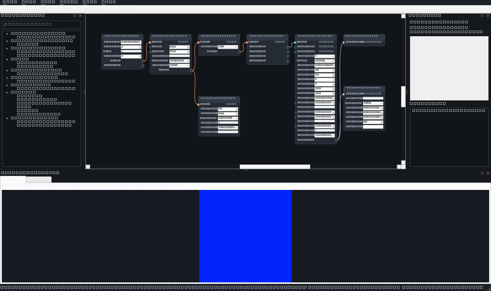

# Phase 4 completion report

## Status

Phase 4 — Production engine process, camera, and MIDI output is complete on Windows 11 x64 using
the project-local, uv-managed CPython 3.12 environment and PySide6 6.10.

Production application composition now keeps Qt and the editable `GraphDocument` in the parent
process and runs graph execution behind a supervised spawned `ProcessEngineClient`/`EngineServer`
boundary. Runtime instances, source handles, immutable float32 processing values, MIDI output,
debug audio, preview production, and profiling remain child-owned. The UI process never constructs
`InProcessEngineClient`; that implementation is used only inside `EngineServer` as the child-local
runtime facade.

Phase 4 also delivers reconnecting OpenCV camera input and persistent exact-port MIDI output. No
physical camera was available during acceptance, so camera frame, outage, reconnect, backend, and
lifecycle behavior was verified with deterministic simulated captures. The user-authorized
`loopMIDI Port 2` was exercised through the production `MidiOutputService`; explicit note-off,
CC123 panic, and deterministic close all completed. Receipt in the separate MIDIView application
was not machine-observed and is not claimed.

The Phase 4 implementation and evidence checkpoints are:

- `47be6e1` — `feat(engine): add supervised process transport and shared previews`
- `eece413` — `feat(engine): atomically swap runtime plans`
- `443447c` — `feat(engine): expose bounded source mailbox metrics`
- `dd43dd4` — `feat(camera): add reconnecting live camera source`
- `68c1bf5` — `feat(midi): add safe persistent output service`
- `36c414f` — `feat(app): supervise production engine process`
- `2905d60` — `test(phase4): capture process and device evidence`

## Implemented

### Supervised process boundary

- Added Windows-spawn-safe child bootstrap, versioned command/response/event contracts, request
  correlation, heartbeat monitoring, graceful shutdown, forced termination, restart, and idempotent
  cleanup.
- Production bootstrap calls `multiprocessing.freeze_support()` and constructs only
  `ProcessEngineClient`. `MainWindow` continues to consume the abstract `EngineClient` contract, so
  no Qt widget owns or imports a scheduler, source, MIDI service, synth, or runtime node.
- One duplex process connection carries serialized commands and responses. A bounded event queue
  carries heartbeats, errors, and compact preview metadata rather than full-rate processing values.
- Engine status retains the child PID, exit code, configured crash-log path, connection state, and
  stopped details after process-handle disposal.
- Typed command failures remain IPC errors. An uncaught child `BaseException` writes a traceback to
  the configured crash log, disconnects the client within bounded time, and leaves the parent UI
  alive.
- The client retains the latest valid graph snapshot and demand roots. Restart starts a fresh child
  and rebuilds that snapshot with `ResetReason.ENGINE_RESTARTED` without reopening the document.
- The UI presents one crash dialog per failure signature, keeps persistent stopped details and a
  restart action, and preserves the document plus undo history across child failure.

### Bounded shared-memory previews

- Parent/UI-owned shared-memory slots carry only sanitized, throttled uint8 image-preview bytes with
  dimensions, sequence numbers, generation, node ID, and tick metadata. Full-rate float32 frames and
  Qt objects never cross the process boundary.
- The child attaches, writes, and closes mappings but never unlinks parent-owned slots. Parent
  cleanup unlinks slots after normal close, graph-generation replacement, or forced child death.
- Slot shape/capacity is bounded and replacement-safe. A wrong-shape write cannot corrupt the last
  valid preview.
- Note previews remain compact immutable desired-state summaries and do not require image shared
  memory.

### Atomic runtime plans and parameter semantics

- Candidate snapshots validate, compile, and prepare before they can replace the active execution
  plan. An invalid graph or runtime-factory failure disposes candidate resources and leaves the last
  valid plan operational.
- A prepared plan swaps only at a safe tick boundary. Compatible state is retained by stable node
  identity, implementation version, source clock, and update mode; incompatible state is reset and
  old runtimes/resources are retired after replacement.
- `LIVE` updates preserve compatible runtime state, `RECOMPILE` updates replace the affected
  runtime, and `RESTART_SOURCE` updates invalidate and rebuild the complete source-clock component.
- Source quiesce failure rolls the attempted replacement back, preserving the old sources, runtime
  set, and active graph revision.
- Stop, reload, source retirement, plan retirement, restart, and shutdown propagate reset/close
  hooks to child-owned MIDI and debug-audio sinks.

### Bounded source mailboxes and metrics

- Each source has capacity for one active frame and one pending frame. A newer live frame replaces a
  stale pending frame, so source-to-processing latency cannot grow as an unbounded queue.
- Drops before processing and skips from `process_every_nth_frame` are tracked separately and
  surfaced through source status, engine metrics, and the UI status line.
- Deliberately blocked-node tests prove latest-frame replacement, bounded retained age, monotonic
  processed ticks, and visible drop counts.

### Reconnecting camera input

- Added a stable Load Camera definition with exact `opencv:<index>` device IDs and
  `RESTART_SOURCE` semantics for device, requested size/FPS, backend preference, frame selection,
  and reconnect policy.
- Camera enumeration runs asynchronously, deduplicates results, and caches them without opening a
  device on the UI thread.
- Capture runs on a background thread with minimal requested buffering. AUTO tries Media Foundation
  first and DirectShow second; an explicitly selected backend is never silently substituted.
- Requested and negotiated width, height, and FPS are reported. Receipt uses monotonic timestamps,
  BGR uint8 frames become immutable normalized RGB float32 values, and Nth-frame selection preserves
  source timing semantics.
- Read/open failure publishes explicit `NoData`, resets the source component, and uses interruptible
  capped exponential reconnect. Stop interrupts reconnect wait immediately; disabling automatic
  reconnect produces a stable unavailable state.
- Simulated captures prove successful frames, disconnect, outage ticks, reset, reconnect, negotiated
  status, and final cleanup. A real spawned client separately proves that camera graph activation and
  source ownership occur in a child PID without opening physical hardware.

### Persistent safe MIDI output

- Added Send MIDI as a demand-root output node over complete desired `MidiStateFrame` snapshots,
  backed by Mido and `mido.backends.rtmidi` through a mockable adapter.
- `MidiOutputService` owns enumeration, exact-name open, persistent-port lifetime, sent-state diff,
  panic, and close on a dedicated sender thread. Graph-side `publish()` writes to a one-slot latest
  desired-state mailbox and remains nonblocking; overwritten updates are counted.
- Empty selection never opens a port. A missing exact target reports `UNAVAILABLE`; no other
  enumerated output is substituted. Port disappearance/reappearance retries only the same exact
  selected name.
- Diffs use deterministic `MidiNoteKey` ordering, send note-offs before note-ons, and update tracked
  sent state only after successful backend sends.
- Velocity changes support Ignore while held, Retrigger, and Repeat note-on policies with a default
  threshold of four.
- Port open is guarded with CC123. Stop, source reset, node retirement, port switch, send/enumeration
  error, panic, and shutdown use explicit tracked note-offs plus CC123 best-effort panic and close.
  Partial-send tests prove only successful sends enter tracked state.
- Compact MIDI status is queryable over IPC without opening hardware. It includes exact selection,
  available outputs, connection state, active-note/channel counts, dropped desired states, sender
  thread identity, and recoverable error details.

### Preserved Phase 3 vertical slice

- The canonical eight-node Hue Chord graph remains unchanged and portable. Generate Audio remains
  explicit opt-in and saved disabled.
- Spawned acceptance materializes its generated seven-frame hue video, activates the graph in a
  distinct child PID, processes exactly seven ticks without drops, and reaches the expected final
  desired note: channel 0, MIDI note 71, velocity 100.
- The same acceptance path receives an immutable 500×500×3 uint8 image preview through one bounded
  shared-memory slot and the matching final note preview.

## Protocols and interfaces

### Engine protocol version 5

The final Phase 4 process protocol is `ENGINE_PROTOCOL_VERSION = 5`. The camera/source contract was
introduced in protocol version 4; compact MIDI query/status completed version 5. Both peers reject
unsupported versions rather than attempting an unsafe partial conversation.

The versioned dataclass protocol covers:

- child hello/handshake and parent/child process identity;
- graph activation with graph revision and reset reason;
- play, pause, resume, stop, reload, seek, panic, and close;
- source status, MIDI output status, engine metrics, and idle synchronization;
- image-preview slot descriptors, image-ready metadata, compact note previews, heartbeats, and
  structured engine errors.

### Public boundaries

- `synesthesia_machine.contracts.engine_client`
  - process-aware `EngineStatus`/`EngineMetrics`, source and MIDI status, preview polling, restart,
    and the unchanged UI-facing `EngineClient` protocol;
- `synesthesia_machine.contracts.engine_messages`
  - protocol-v5 typed commands, responses, async events, revision IDs, and preview descriptors;
- `synesthesia_machine.runtime.ProcessEngineClient`
  - parent-side process lifecycle, correlation, heartbeat supervision, restart, crash details, and
    shared-preview ownership;
- `synesthesia_machine.runtime.EngineServer`
  - child-side command dispatch around the child-local `InProcessEngineClient` runtime;
- `synesthesia_machine.runtime.shared_previews`
  - bounded uint8 shared-memory descriptors, writers, readers, sequence publication, and unlinking;
- `synesthesia_machine.media.CameraSourceService`
  - asynchronous enumeration and reconnecting background OpenCV capture;
- `synesthesia_machine.midi.MidiOutputService`
  - persistent exact-port sender-thread service, desired-state reconciliation, status, panic, and
    close;
- application registry definitions for Load Camera and Send MIDI to MIDI Output.

## Exit-criteria evidence

| Phase 4 criterion | Evidence |
| --- | --- |
| Camera graphs run in the engine process | Spawned activation reports a child PID distinct from the test/UI PID and a READY camera source without opening hardware. Deterministic production-service integration injects simulated frames, `NoData`, reconnect, and lifecycle transitions. |
| Real or loopback MIDI ports can be selected safely | The authorized exact name `loopMIDI Port 2` was enumerated, opened on the production sender thread, sent low-velocity C4, explicitly released, panicked with CC123, and closed. No arbitrary output was substituted. |
| UI remains responsive under load | The 30-second process-backed diagnostic received 600/600 heartbeat callbacks with 50.859865 ms p95 and 52.4487 ms maximum intervals; `responsive=true`. Slow-node tests separately prove bounded drops rather than growing latency. |
| Lifecycle transitions leave no tracked notes active | The complete mock safety matrix covers stop/reset/retirement/switch/error/panic/close. Real loopback evidence records one active note after note-on, zero after explicit note-off, zero after panic, and final state `CLOSED`. |
| Invalid candidates preserve the valid runtime | Atomic-plan tests cover validation/runtime-factory failures and source-quiesce rollback while the old revision remains operational. |
| Child failure does not kill the UI | Process and UI tests force child failure, retain document/undo state, expose crash/exit details, and rebuild the latest valid snapshot in a new child. |
| Shared memory is bounded and cleaned | Shared-preview tests cover round trip, wrong shape, graph generation replacement, graceful close, and forced child termination with parent unlink. |

## Tests and results

Final acceptance was run on Windows 11 x64 with CPython 3.12.13:

| Command | Result |
| --- | --- |
| `uv run check` | Passed; 130 Python files already formatted, Ruff clean, strict Pyright with 0 errors, warnings, or information messages. |
| `uv run python -m pytest tests/phase4 -q` | Passed; 75 Phase 4 tests in 7.35 seconds. |
| `uv run test` | Passed; 267 tests in 11.12 seconds, retaining all Phase 1–3 and smoke regressions. |
| `$env:QT_QPA_PLATFORM='offscreen'; uv run synmachine --smoke-test` | Passed; production application composition logged normal UI start and stop. PySide6 emitted its known missing bundled-font-directory warning. |
| `uv run python -m tools.phase4_performance` | Passed; 5-second warm-up plus 30-second spawned-engine UI diagnostic wrote JSON and PNG evidence. |
| `uv run python -m tools.phase4_midi_evidence --port 'loopMIDI Port 2' --confirm-exact-port 'loopMIDI Port 2' --hold-seconds 1` | Passed; exact-port lifecycle reached explicit note-off, panic, and `CLOSED`, then wrote JSON evidence. |
| `git diff --check` | Passed before the evidence checkpoint; no whitespace errors. |

The Phase 4 suite covers:

- process handshake, protocol mismatch, correlated concurrent requests, activation, metrics,
  bounded command failure, graceful/forced close, uncaught-child crash logs, exit-code retention,
  restart, and latest-valid-snapshot reconstruction;
- invalid-candidate rejection, compatible state preservation, all three parameter update modes,
  implementation/source-clock incompatibility, resource retirement, and quiesce rollback;
- shared-memory image immutability, capacity/shape protection, generation replacement, normal close,
  and forced-death unlinking;
- slow-node latest-frame replacement, bounded latency, drops, and status/metric visibility;
- exact camera IDs, AUTO fallback and explicit-backend no-substitution, cached worker enumeration,
  BGR-to-RGB conversion, immutable float32 frames, Nth selection, negotiated properties, simulated
  outage/reconnect/backoff, stop interruption, unavailable state, engine injection, source rebuild,
  and spawned registration;
- empty/missing MIDI selection, exact persistent open, off-before-on ordering, each velocity policy,
  mailbox overwrite, blocked sender behavior, open/send/enumeration failures, successful-send-only
  tracking, disappearance/reappearance, panic failure, port switch, reset/retirement/shutdown,
  idempotent close, real-adapter message shape, compact IPC status, and no-hardware spawned query;
- production bootstrap composition, crash UI behavior, document/undo preservation, and restart;
- spawned canonical Hue Chord playback, child PID, disabled debug audio, exact final note, bounded
  shared-memory image preview, and compact note preview;
- evidence-tool exact-name refusal and production-service message/lifecycle ordering through a mock
  backend.

Automated tests never require physical camera, MIDI, or audio devices. Camera behavior uses injected
capture factories, MIDI uses mock backends/ports, audio uses mock callback streams, and video uses
generated temporary media. The only real MIDI open/send was the separate explicitly authorized
acceptance command recorded below.

## Performance

Raw evidence is committed as [`phase-4-performance.json`](phase-4-performance.json), with the
captured 1600×950 offscreen window at [`phase-4-ui.png`](phase-4-ui.png). The artifact records commit
`36c414f`, the implementation checkpoint current when the diagnostic ran; the evidence harness and
raw artifacts were subsequently committed in `2905d60`.

The run used the real `MainWindow`, real `ProcessEngineClient`, spawned `EngineServer`, canonical
Hue Chord graph, shared-memory image preview, compact note preview, and a generated looping 500×500,
60 FPS MPEG-4 fixture. Generate Audio was asserted disabled, so no physical audio device was opened.
Windows reported the High performance power scheme. A 5-second warm-up preceded the 30-second
measurement.

| Measurement | Result |
| --- | ---: |
| Parent / child PID | 29,588 / 25,968 |
| Separate process / connection | true / `CONNECTED` |
| Requested / observed measured duration | 30.0 s / 30.0010677 s |
| Input fixture | 500×500, 60 FPS, 600 frames, MPEG-4/yuv420p, 10-second loop |
| Cumulative processed ticks at capture | 2,094 (includes warm-up) |
| Processed FPS | 59.8941257 |
| Aggregate p95 node invocation time | 2.28578 ms |
| Dropped before processing | 4 |
| Skipped by selection | 0 |
| Final / peak sampled child RSS | 135.58 MiB / 135.58 MiB (142,163,968 bytes) |
| Source warnings / last error | 0 / none |
| UI heartbeat callbacks | 600 of 600 (100%) |
| UI heartbeat p50 / p95 / maximum | 50.01075 / 50.859865 / 52.4487 ms |
| Preview state | image visible; note state visible |

The responsiveness criterion was a callback ratio of at least 90%, p95 interval no greater than
100 ms, and maximum interval no greater than 250 ms. The run passed all limits. Four bounded drops
were visible rather than accumulating stale latency.

This is a process-backed Phase 4 vertical-slice diagnostic, not the full architecture section 5.1
reference benchmark: Gaussian Blur and Canny belong to Phase 5 and were intentionally not added.
Current engine IPC exposes processed FPS, drops, memory, and aggregate p95 node time, but not a
separate measured input-FPS counter, aggregate p50/p99, or per-node rolling timings. The artifact is
one evidence run rather than the three-run median required for a future release gate.

## Camera and MIDI checks

### Camera

No physical camera was available. No report claims a real camera open or negotiated hardware mode.
Acceptance instead used two complementary forms of evidence:

1. deterministic fake-capture tests exercise the production `CameraSourceService` through frames,
   backend fallback, requested/negotiated properties, disconnect, `NoData`, reset, reconnect,
   backoff, stop interruption, and cleanup; and
2. a real Windows-spawn `ProcessEngineClient` activates a Load Camera graph, reports a different
   child PID, and exposes the camera source as READY without opening hardware.

This verifies camera behavior and process ownership under the stated hardware constraint. A future
physical-camera compatibility check remains useful but is not represented as completed evidence.

### MIDI

Raw exact-port evidence is committed as
[`phase-4-midi-evidence.json`](phase-4-midi-evidence.json). Before opening, the real RtMidi backend
enumerated:

```text
Microsoft GS Wavetable Synth 0
DESKTOP-06R9GT7 1
loopMIDI Port 2
```

The command required `--port` and `--confirm-exact-port` to repeat the same authorized non-empty
name. It opened only `loopMIDI Port 2` and performed:

1. CC123 open guard on runtime channel 0;
2. note-on for C4 / MIDI 60 at velocity 32;
3. a one-second hold;
4. desired empty state producing explicit note-off;
5. synchronous CC123 panic; and
6. persistent-port close in guaranteed cleanup.

The production service reported one active note after note-on, zero after explicit note-off, zero
after panic, no errors, zero dropped state updates, `panic_completed=true`,
`close_completed=true`, and final connection state `CLOSED`. This proves the application-side
loopback send lifecycle and cleanup. It does not prove what MIDIView displayed: visual MIDIView
receipt was not machine-observed and remains unconfirmed unless separately reported by the user.

## Screenshot



`docs/phase-4-ui.png` is a valid 1600×950, 24-bit RGB PNG captured by the real `MainWindow` at the
end of the offscreen process-backed diagnostic. The machine-readable performance report records
both image and note previews visible and engine state `RUNNING`. Because the Qt platform was
`offscreen`, this artifact is diagnostic evidence rather than a claim of a human-observed physical
display session.

## Known limitations

- Physical camera compatibility was not exercised because no camera was available. Deterministic
  simulated coverage and spawned child ownership are complete; device-specific drivers and
  negotiated modes remain machine-dependent.
- MIDIView visual receipt was not observable by the evidence tool. The real `MidiOutputService`
  lifecycle succeeded on the exact loopMIDI port, but no report claims a separate monitor display.
- The Phase 4 performance run used Qt's `offscreen` platform. Production bootstrap also passed an
  offscreen smoke, with a non-fatal warning that the installed PySide6 package has no bundled font
  directory.
- The full future reference graph includes Gaussian Blur and Canny, which are Phase 5 scope. The
  Phase 4 artifact therefore measures the canonical Hue Chord process boundary rather than those
  unimplemented nodes.
- Performance IPC currently exposes aggregate p95 but not p50/p99 or per-node rolling timings, and
  input FPS is represented by the known generated fixture rate rather than a separate source IPC
  counter.
- The evidence artifact contains one measured run, not a three-run median release benchmark.
- Latest-frame-wins intentionally permits visible drops under contention to keep latency and memory
  bounded.

## Architecture deviations

No architecture deviation, graph-schema migration, or new dependency was introduced, and no new
ADR was required.

The implementation follows accepted ADR-0005: Qt remains parent-owned, runtime work is spawned,
control messages are versioned, preview bytes use bounded shared memory, float32 frames remain
engine-local, and cleanup is idempotent. It also follows ADR-0004 by using Mido with
python-rtmidi behind a testable adapter.

The unavailable physical camera, offscreen UI run, unobserved MIDIView display, and reduced Phase 4
benchmark scope are evidence limitations rather than architecture deviations. They are explicitly
reported instead of being replaced with unsupported claims. Phase 5 nodes were not started.

## Next work

Phase 4 is complete and no Phase 5 implementation is included in this slice. Before or alongside a
separately authorized future phase, useful follow-up evidence would be:

1. repeat camera compatibility against an actual device and record requested versus negotiated
   MSMF/DSHOW modes;
2. manually observe and record loopMIDI traffic in MIDIView if independent receiver confirmation is
   desired;
3. expose source input FPS plus aggregate p50/p99 and per-node rolling timings over the existing
   compact metrics boundary; and
4. run the architecture release benchmark as a three-run median after the graph's future required
   nodes exist.
